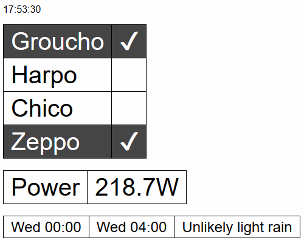

# Home Helper

A simple toolbox app for helping out around the home. Functionality includes:

- Track whether people are at home (i.e. connected to the network)
- Turn a Windows PC on and off
- Turn a TP Link HS110 plug on and off
- Get local weather

Some of these can also be accessed via Amazon Alexa Skills Kit, so you can ask your Echo who's at home.

## Prerequisites
You will need a server/device running in your local home network, as this app will be scanning your network.

1. Ubuntu 14.04 or higher, or similar
2. php 7, though you could probably get away with 5
3. [Composer](https://getcomposer.org/)
4. [redis](https://redis.io/)
5. [nginx](https://nginx.org/)
6. [Certbot](https://certbot.eff.org/)
7. [fping](https://fping.org/)

## Setup
1. Clone this repo to ```home_helper```
2. ```cd home_helper```
3. ```composer install```
4. Copy the following files:
    - app/config/_env.sh.dist -> app/config/_env.sh
    - etc/cron.dist -> etc/cron
    - etc/nginx.conf.dist -> etc/nginx.conf
5. Update the parameters in each of them to match your configuration, including:
    - a [Dark Sky](https://darksky.net/dev/) API key
    - your home members' device MAC addresses
6. Copy the files to the correct system paths
    ```
    sudo cp "$(readlink -f etc/cron)" /etc/cron.d/home_helper
    sudo cp "$(readlink -f etc/nginx.conf)" /etc/nginx/sites-enabled/home_helper
    ```

## Usage

Load ```https://DOMAIN_NAME/dashboard```



## Alexa integration

In order to integrate with Alexa, you'll need to setup a new skill. This skill will need to point to this app in your
local network, so the device hosting this app will need to be accessible to the internet via at least HTTPS.
Additionally, we will keep the skill in development mode, so that only your Amazon account will be able to access it.
We don't want every Tom, Dick, and Harry able to know who and who is not in your home.

### Setup

1. Sign up as an Amazon developer at https://developer.amazon.com/
2. Create a new Alexa skill https://developer.amazon.com/edw/home.html#/skill/create/
    1. Skill type: Custom interaction model
    2. Language: English (UK) (or whatever)
    3. Name: Home Helper (or similar) 
    4. Invocation name: Home (or similar)
    5. Audio player: no
    6. Interaction model: see [resources/alexa-interaction-model.json](resources/alexa-interaction-model.json)
    7. Custom slot type:
        - Name: OCCUPANT
        - Values: the list of your house members' names
    8. Sample utterances: see [resources/alexa-sample-utterances.txt](resources/alexa-sample-utterances.txt)
    9. Endpoint: HTTPS / Europe (or whatever) / Your URL
    10. Account linking: no
    11. SSL Certificate: My development endpoint has a certificate from a trusted certificate authority
3. Get the Application ID of your newly created skill and add it to [app/config/parameters.yml](app/config/parameters.yml)

### Usage
```Alexa, ask Home who is in```
```Alexa, ask Home if Barry is around?```
```Alexa, tell Home to turn on my computer```